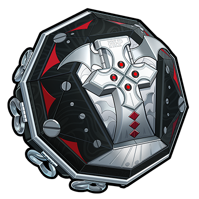

# 攻略圖示對照表

由 `node scripts/sync-icons.cjs` 產生。角色、音擎、驅動盤資料分別在 data/characters.json、data/wengines.json、data/discs.json；自訂圖示在 data/custom-icons.json；操作統一使用 action。

| 引用 | 圖示 | 繁中名稱 | 分類 | Wiki ID | 備註 |
| --- | --- | --- | --- | --- | --- |
| `{{22}}` |  | 11號 | 角色 | 22 |  |
| `{{23}}` |  | 可琳 | 角色 | 23 |  |
| `{{7}}` |  | 哲 | 角色 | 7 | 繩匠；非戰鬥代理人 |
| `{{20}}` |  | 妮可 | 角色 | 20 |  |
| `{{24}}` |  | 安東 | 角色 | 24 |  |
| `{{2}}` |  | 安比 | 角色 | 2 |  |
| `{{25}}` |  | 本 | 角色 | 25 |  |
| `{{27}}` |  | 格莉絲 | 角色 | 27 |  |
| `{{19}}` |  | 比利 | 角色 | 19 |  |
| `{{26}}` |  | 珂蕾妲 | 角色 | 26 |  |
| `{{29}}` |  | 艾蓮 | 角色 | 29 |  |
| `{{28}}` |  | 萊卡恩 | 角色 | 28 |  |
| `{{89}}` |  | 蒼角 | 角色 | 89 |  |
| `{{21}}` |  | 貓又 | 角色 | 21 |  |
| `{{8}}` |  | 鈴 | 角色 | 8 | 繩匠；非戰鬥代理人 |
| `{{30}}` |  | 麗娜 | 角色 | 30 |  |
| `{{31}}` |  | 朱鳶 | 角色 | 31 |  |
| `{{368}}` |  | 簡 | 角色 | 368 |  |
| `{{369}}` |  | 賽斯 | 角色 | 369 |  |
| `{{350}}` |  | 青衣 | 角色 | 350 |  |
| `{{381}}` |  | 凱撒 | 角色 | 381 |  |
| `{{382}}` |  | 柏妮思 | 角色 | 382 |  |
| `{{126}}` |  | 派派 | 角色 | 126 |  |
| `{{125}}` |  | 露西 | 角色 | 125 |  |
| `{{529}}` |  | 月城柳 | 角色 | 529 |  |
| `{{530}}` |  | 萊特 | 角色 | 530 |  |
| `{{537}}` |  | 星見雅 | 角色 | 537 |  |
| `{{538}}` |  | 淺羽悠真 | 角色 | 538 |  |
| `{{589}}` |  | 伊芙琳 | 角色 | 589 |  |
| `{{588}}` |  | 耀嘉音 | 角色 | 588 |  |
| `{{620}}` |  | 扳機 | 角色 | 620 |  |
| `{{619}}` |  | 波可娜 | 角色 | 619 |  |
| `{{618}}` |  | 零號·安比 | 角色 | 618 |  |
| `{{707}}` |  | 雨果 | 角色 | 707 |  |
| `{{626}}` |  | 薇薇安 | 角色 | 626 |  |
| `{{752}}` |  | 儀玄 | 角色 | 752 |  |
| `{{750}}` |  | 橘福福 | 角色 | 750 |  |
| `{{751}}` |  | 潘引壺 | 角色 | 751 |  |
| `{{838}}` |  | 愛麗絲 | 角色 | 838 |  |
| `{{837}}` |  | 浮波柚葉 | 角色 | 837 |  |
| `{{901}}` |  | 「席德」 | 角色 | 901 |  |
| `{{902}}` |  | 奧菲絲&「鬼火」 | 角色 | 902 |  |
| `{{909}}` |  | 伊德海莉 | 角色 | 909 |  |
| `{{908}}` |  | 狛野真斗 | 角色 | 908 |  |
| `{{907}}` |  | 盧西婭 | 角色 | 907 |  |
| `{{932}}` |  | 琉音 | 角色 | 932 |  |
| `{{934}}` |  | 般岳 | 角色 | 934 |  |
| `{{960}}` |  | 照 | 角色 | 960 |  |
| `{{961}}` |  | 葉瞬光 | 角色 | 961 |  |
| `{{995}}` |  | 千夏 | 角色 | 995 |  |
| `{{998}}` |  | 愛芮 | 角色 | 998 |  |
| `{{1038}}` |  | 南宮羽 | 角色 | 1038 |  |
| `{{1039}}` |  | 希希芙 | 角色 | 1039 |  |
| `{{1073}}` |  | 星徽·比利 | 角色 | 1073 |  |
| `{{1072}}` |  | 普羅米婭 | 角色 | 1072 |  |
| `{{1082}}` |  | 佩洛伊斯 | 角色 | 1082 |  |
| `{{1084}}` |  | 維琳娜 | 角色 | 1084 |  |
| `{{1085}}` |  | 諾姆 | 角色 | 1085 |  |
| `{{1113}}` |  | 希格莉德 | 角色 | 1113 |  |
| `{{1112}}` |  | 蕾米埃爾 | 角色 | 1112 |  |
| `{{1185}}` |  | 克拉蕾 | 角色 | 1185 |  |
| `{{1186}}` |  | 洛克茜 | 角色 | 1186 |  |
| `{{1202}}` |  | 賽維裡安·洛威爾 | 角色 | 1202 |  |
| `{{1201}}` |  | 菲歐妮·蕾法愛菈 | 角色 | 1201 |  |
| `{{wengine:1209}}` |  | 緋月銀棺 | 音擎 | 1209 | S級／擊破 |
| `{{wengine:1192}}` |  | 「月相」-弦 | 音擎 | 1192 | B級／鋒御 |
| `{{wengine:1191}}` |  | 喵運當頭 | 音擎 | 1191 | A級／鋒御 |
| `{{wengine:1190}}` |  | 血髓秘匣 | 音擎 | 1190 | A級／鋒御 |
| `{{wengine:1189}}` |  | 猩紅渴望 | 音擎 | 1189 | S級／鋒御 |
| `{{wengine:1188}}` |  | 驍騎禮讚 | 音擎 | 1188 | S級／強攻 |
| `{{wengine:1174}}` |  | 空羽復歸之詩 | 音擎 | 1174 | S級／異常 |
| `{{wengine:1134}}` |  | 首席跟班 | 音擎 | 1134 | S級／擊破 |
| `{{wengine:1106}}` |  | 咚噠回聲 | 音擎 | 1106 | A級 |
| `{{wengine:1105}}` |  | 日冕遺蛻 | 音擎 | 1105 | S級／強攻 |
| `{{wengine:1104}}` |  | 琳琅鎏心 | 音擎 | 1104 | S級／異常 |
| `{{wengine:1088}}` |  | 輝騎面鎧 | 音擎 | 1088 | S級／命破 |
| `{{wengine:1087}}` |  | 朔月裁霜 | 音擎 | 1087 | S級／異常 |
| `{{wengine:1078}}` |  | 鱗齒尋蹤 | 音擎 | 1078 | S級／強攻 |
| `{{wengine:1068}}` |  | 炎炙沸釜 | 音擎 | 1068 | A級／擊破 |
| `{{wengine:1067}}` |  | 霓虹妄想 | 音擎 | 1067 | S級／擊破 |
| `{{wengine:1047}}` |  | 殼中之靈 | 音擎 | 1047 | S級／異常 |
| `{{wengine:1015}}` |  | 思絡成歌 | 音擎 | 1015 | S級／支援 |
| `{{wengine:984}}` |  | 青漪靈鼎 | 音擎 | 984 | A級／命破 |
| `{{wengine:983}}` |  | 半糖雪兔 | 音擎 | 983 | S級 |
| `{{wengine:982}}` |  | 雲霓孤光 | 音擎 | 982 | S級／強攻 |
| `{{wengine:965}}` |  | 怒目金剛 | 音擎 | 965 | S級／命破 |
| `{{wengine:964}}` |  | 昨夜來電 | 音擎 | 964 | S級／擊破 |
| `{{wengine:937}}` |  | 海妖搖籃 | 音擎 | 937 | S級／命破 |
| `{{wengine:936}}` |  | 燔火朧夜 | 音擎 | 936 | A級／命破 |
| `{{wengine:935}}` |  | 鑄夢爐歌 | 音擎 | 935 | S級／支援 |
| `{{wengine:929}}` |  | 來自「海巫師」的尋夢瓶 | 音擎 | 929 | S級／強攻 |
| `{{wengine:910}}` |  | 機巧心種 | 音擎 | 910 | S級／強攻 |
| `{{wengine:903}}` |  | 十方鍛星 | 音擎 | 903 | S級／異常 |
| `{{wengine:877}}` |  | 狸法七變化 | 音擎 | 877 | S級／支援 |
| `{{wengine:851}}` |  | 福虓爐爐 | 音擎 | 851 | S級／擊破 |
| `{{wengine:787}}` |  | 「灰燼」-鈷藍 | 音擎 | 787 | B級／命破 |
| `{{wengine:786}}` |  | 電波漫步 | 音擎 | 786 | A級／命破 |
| `{{wengine:785}}` |  | 幻變魔方 | 音擎 | 785 | A級／命破 |
| `{{wengine:784}}` |  | 光影刻刀 | 音擎 | 784 | A級／防護 |
| `{{wengine:783}}` |  | 震元奇樞 | 音擎 | 783 | A級／防護 |
| `{{wengine:782}}` |  | 青溟籠舍 | 音擎 | 782 | S級 |
| `{{wengine:706}}` |  | 千面日隕 | 音擎 | 706 | S級／強攻 |
| `{{wengine:705}}` |  | 飛鳥星夢 | 音擎 | 705 | S級／異常 |
| `{{wengine:701}}` |  | 索魂影眸 | 音擎 | 701 | S級／擊破 |
| `{{wengine:622}}` |  | 裁紙刀 | 音擎 | 622 | A級／擊破 |
| `{{wengine:621}}` |  | 犧牲潔純 | 音擎 | 621 | S級／強攻 |
| `{{wengine:591}}` |  | 心弦夜響 | 音擎 | 591 | S級／強攻 |
| `{{wengine:590}}` |  | 玲瓏妝匣 | 音擎 | 590 | S級／支援 |
| `{{wengine:541}}` |  | 殘心青囊 | 音擎 | 541 | S級／強攻 |
| `{{wengine:540}}` |  | 霰落星殿 | 音擎 | 540 | S級／異常 |
| `{{wengine:539}}` |  | 強音熱望 | 音擎 | 539 | A級／強攻 |
| `{{wengine:534}}` |  | 焰心桂冠 | 音擎 | 534 | S級／擊破 |
| `{{wengine:531}}` |  | 時流賢者 | 音擎 | 531 | S級／異常 |
| `{{wengine:525}}` |  | 灼心搖壺 | 音擎 | 525 | S級／異常 |
| `{{wengine:389}}` |  | 奔襲獠牙 | 音擎 | 389 | S級／防護 |
| `{{wengine:378}}` |  | 維序者-特化型 | 音擎 | 378 | A級／防護 |
| `{{wengine:377}}` |  | 淬鋒鉗刺 | 音擎 | 377 | S級／異常 |
| `{{wengine:355}}` |  | 玉壺青冰 | 音擎 | 355 | S級／擊破 |
| `{{wengine:354}}` |  | 鎏金花信 | 音擎 | 354 | A級／強攻 |
| `{{wengine:274}}` |  | 轟鳴座駕 | 音擎 | 274 | A級／異常 |
| `{{wengine:273}}` |  | 好鬥的阿炮 | 音擎 | 273 | A級／支援 |
| `{{wengine:87}}` |  | 防暴者VI型 | 音擎 | 87 | S級／強攻 |
| `{{wengine:86}}` |  | 啜泣搖籃 | 音擎 | 86 | S級／支援 |
| `{{wengine:85}}` |  | 深海訪客 | 音擎 | 85 | S級／強攻 |
| `{{wengine:84}}` |  | 嵌合編譯器 | 音擎 | 84 | S級／異常 |
| `{{wengine:83}}` |  | 拘縛者 | 音擎 | 83 | S級／擊破 |
| `{{wengine:82}}` |  | 燃獄齒輪 | 音擎 | 82 | S級／擊破 |
| `{{wengine:81}}` |  | 硫磺石 | 音擎 | 81 | S級／強攻 |
| `{{wengine:80}}` |  | 鋼鐵肉墊 | 音擎 | 80 | S級／強攻 |
| `{{wengine:79}}` |  | 左輪轉子 | 音擎 | 79 | A級／擊破 |
| `{{wengine:78}}` |  | 逍遙遊球 | 音擎 | 78 | A級／支援 |
| `{{wengine:77}}` |  | 加農轉子 | 音擎 | 77 | A級／強攻 |
| `{{wengine:76}}` |  | 含羞惡面 | 音擎 | 76 | A級／支援 |
| `{{wengine:75}}` |  | 比格氣缸 | 音擎 | 75 | A級／防護 |
| `{{wengine:74}}` |  | 旋鑽機-赤軸 | 音擎 | 74 | A級／強攻 |
| `{{wengine:73}}` |  | 仿製星徽引擎 | 音擎 | 73 | A級／強攻 |
| `{{wengine:72}}` |  | 居家服務員 | 音擎 | 72 | A級／強攻 |
| `{{wengine:71}}` |  | 聚寶箱 | 音擎 | 71 | A級／支援 |
| `{{wengine:69}}` |  | 春日融融 | 音擎 | 69 | A級／防護 |
| `{{wengine:68}}` |  | 兔能環 | 音擎 | 68 | A級／防護 |
| `{{wengine:67}}` |  | 觸電唇彩 | 音擎 | 67 | A級／異常 |
| `{{wengine:66}}` |  | 雙生泣星 | 音擎 | 66 | A級／異常 |
| `{{wengine:65}}` |  | 正版變身器 | 音擎 | 65 | A級／防護 |
| `{{wengine:64}}` |  | 貴重骨核 | 音擎 | 64 | A級／擊破 |
| `{{wengine:63}}` |  | 人為刀俎 | 音擎 | 63 | A級／擊破 |
| `{{wengine:62}}` |  | 星徽引擎 | 音擎 | 62 | A級／強攻 |
| `{{wengine:61}}` |  | 雨林饕客 | 音擎 | 61 | A級／異常 |
| `{{wengine:60}}` |  | 時光切片 | 音擎 | 60 | A級／支援 |
| `{{wengine:59}}` |  | 街頭巨星 | 音擎 | 59 | A級／強攻 |
| `{{wengine:58}}` |  | 「恆等式」-變格 | 音擎 | 58 | B級／防護 |
| `{{wengine:57}}` |  | 「恆等式」-本格 | 音擎 | 57 | B級／防護 |
| `{{wengine:56}}` |  | 「電磁暴」-参式 | 音擎 | 56 | B級／異常 |
| `{{wengine:55}}` |  | 「電磁暴」-貳式 | 音擎 | 55 | B級／異常 |
| `{{wengine:54}}` |  | 「電磁暴」-壹式 | 音擎 | 54 | B級／異常 |
| `{{wengine:53}}` |  | 「湍流」-斧型 | 音擎 | 53 | B級／擊破 |
| `{{wengine:52}}` |  | 「湍流」-矢型 | 音擎 | 52 | B級／擊破 |
| `{{wengine:51}}` |  | 「湍流」-銃型 | 音擎 | 51 | B級／擊破 |
| `{{wengine:50}}` |  | 「殘響」-Ⅲ型 | 音擎 | 50 | B級／支援 |
| `{{wengine:49}}` |  | 「殘響」-Ⅱ型 | 音擎 | 49 | B級／支援 |
| `{{wengine:48}}` |  | 「殘響」-Ⅰ型 | 音擎 | 48 | B級／支援 |
| `{{wengine:47}}` |  | 「月相」-朔 | 音擎 | 47 | B級／強攻 |
| `{{wengine:46}}` |  | 「月相」-晦 | 音擎 | 46 | B級／強攻 |
| `{{wengine:45}}` |  | 「月相」-望 | 音擎 | 45 | B級／強攻 |
| `{{wengine:3}}` |  | 德瑪拉電池Ⅱ型 | 音擎 | 3 | A級／擊破 |
| `{{disc:1177}}` |  | 荊棘玫瑰 | 驅動盤 | 1177 |  |
| `{{disc:1176}}` |  | 讖羽之誓 | 驅動盤 | 1176 |  |
| `{{disc:1109}}` |  | 拂曉行紀 | 驅動盤 | 1109 |  |
| `{{disc:1108}}` |  | 呼嘯沙龍 | 驅動盤 | 1108 |  |
| `{{disc:1070}}` |  | 囚徒手記 | 驅動盤 | 1070 |  |
| `{{disc:1069}}` |  | 雪兔夢遊仙境 | 驅動盤 | 1069 |  |
| `{{disc:993}}` |  | 流光詠嘆 | 驅動盤 | 993 |  |
| `{{disc:992}}` |  | 滄浪行歌 | 驅動盤 | 992 |  |
| `{{disc:914}}` |  | 月光騎士頌 | 驅動盤 | 914 |  |
| `{{disc:913}}` |  | 拂曉生花 | 驅動盤 | 913 |  |
| `{{disc:790}}` |  | 山大王 | 驅動盤 | 790 |  |
| `{{disc:789}}` |  | 雲巋如我 | 驅動盤 | 789 |  |
| `{{disc:625}}` |  | 如影相隨 | 驅動盤 | 625 |  |
| `{{disc:624}}` |  | 法厄同之歌 | 驅動盤 | 624 |  |
| `{{disc:547}}` |  | 折枝劍歌 | 驅動盤 | 547 |  |
| `{{disc:546}}` |  | 靜聽嘉音 | 驅動盤 | 546 |  |
| `{{disc:392}}` |  | 混沌爵士 | 驅動盤 | 392 |  |
| `{{disc:391}}` |  | 原始龐克 | 驅動盤 | 391 |  |
| `{{disc:137}}` |  | 獠牙重金屬 | 驅動盤 | 137 |  |
| `{{disc:136}}` |  | 極地重金屬 | 驅動盤 | 136 |  |
| `{{disc:135}}` |  | 雷暴重金屬 | 驅動盤 | 135 |  |
| `{{disc:134}}` |  | 混沌重金屬 | 驅動盤 | 134 |  |
| `{{disc:133}}` |  | 炎獄重金屬 | 驅動盤 | 133 |  |
| `{{disc:132}}` |  | 靈魂搖滾 | 驅動盤 | 132 |  |
| `{{disc:131}}` |  | 激素龐克 | 驅動盤 | 131 |  |
| `{{disc:130}}` |  | 自由藍調 | 驅動盤 | 130 |  |
| `{{disc:129}}` |  | 震星迪斯可 | 驅動盤 | 129 |  |
| `{{disc:128}}` |  | 河豚電音 | 驅動盤 | 128 |  |
| `{{disc:127}}` |  | 啄木鳥電音 | 驅動盤 | 127 |  |
| `{{disc:5}}` |  | 搖擺爵士 | 驅動盤 | 5 |  |
| `{{element:physical}}` |  | 物理 | 元素 |  |  |
| `{{element:fire}}` |  | 火屬性 | 元素 |  |  |
| `{{element:ice}}` |  | 冰屬性 | 元素 |  |  |
| `{{element:electric}}` |  | 電屬性 | 元素 |  |  |
| `{{element:ether}}` |  | 以太 | 元素 |  |  |
| `{{element:wind}}` |  | 風屬性 | 元素 |  |  |
| `{{element:light}}` |  | 流明 | 元素 |  |  |
| `{{element:frost}}` |  | 烈霜屬性 | 元素 |  |  |
| `{{profession:attack}}` |  | 強攻 | 職業 |  |  |
| `{{profession:breakthrough}}` |  | 擊破 | 職業 |  |  |
| `{{profession:anomaly}}` |  | 異常 | 職業 |  |  |
| `{{profession:support}}` |  | 支援 | 職業 |  |  |
| `{{profession:defensive}}` |  | 防護 | 職業 |  |  |
| `{{profession:rupture}}` |  | 命破 | 職業 |  |  |
| `{{profession:fengyu}}` |  | 鋒御 | 職業 |  |  |
| `{{stat:hp}}` |  | 生命值 | 能力屬性 |  |  |
| `{{stat:atk}}` |  | 攻擊力 | 能力屬性 |  |  |
| `{{stat:def}}` |  | 防禦力 | 能力屬性 |  |  |
| `{{stat:impact}}` |  | 衝擊力 | 能力屬性 |  |  |
| `{{stat:crit_rate}}` |  | 暴擊率 | 能力屬性 |  |  |
| `{{stat:crit_dmg}}` |  | 暴擊傷害 | 能力屬性 |  |  |
| `{{stat:anomaly_proficiency}}` |  | 異常精通 | 能力屬性 |  |  |
| `{{stat:anomaly_mastery}}` |  | 異常掌控 | 能力屬性 |  |  |
| `{{stat:pen_ratio}}` |  | 穿透率 | 能力屬性 |  |  |
| `{{stat:pen_value}}` |  | 穿透值 | 能力屬性 |  |  |
| `{{stat:energy_regen}}` |  | 能量自動回復 | 能力屬性 |  |  |
| `{{stat:physical}}` |  | 物理傷害加成 | 能力屬性 |  |  |
| `{{stat:fire}}` |  | 火屬性傷害加成 | 能力屬性 |  |  |
| `{{stat:ice}}` |  | 冰屬性傷害加成 | 能力屬性 |  |  |
| `{{stat:electric}}` |  | 電屬性傷害加成 | 能力屬性 |  |  |
| `{{stat:ether}}` |  | 以太傷害加成 | 能力屬性 |  |  |
| `{{stat:wind}}` |  | 風屬性傷害加成 | 能力屬性 |  |  |
| `{{stat:perforation}}` |  | 貫穿力 | 能力屬性 |  |  |
| `{{stat:energyaccumulation}}` |  | 閃能自動累積 | 能力屬性 |  |  |
| `{{stat:accumulation}}` |  | 銳能自動累積 | 能力屬性 |  |  |
| `{{stat:sharp}}` |  | 銳暴傷害 | 能力屬性 |  |  |
| `{{rarity:s}}` |  | S級 | 稀有度 |  |  |
| `{{rarity:a}}` |  | A級 | 稀有度 |  |  |
| `{{rarity:b}}` |  | B級 | 稀有度 |  |  |
| `{{action:normal}}` |  | 普通攻擊 | 操作 |  |  |
| `{{action:special}}` |  | 特殊技 | 操作 |  |  |
| `{{action:special_ready}}` |  | 強化特殊技 | 操作 |  |  |
| `{{action:dodge}}` |  | 閃避 | 操作 |  |  |
| `{{action:support}}` |  | 支援技 | 操作 |  |  |
| `{{action:chain}}` |  | 連攜技 | 操作 |  |  |
| `{{action:ultimate}}` |  | 終結技(未就緒) | 操作 |  |  |
| `{{action:ultimate_ready}}` |  | 終結技 | 操作 |  |  |
| `{{action:core}}` |  | 核心技 | 操作 |  |  |
| `{{action:move}}` |  | 移動 | 操作 |  |  |
| `{{element:honededge}}` |  | 凜刃 | 元素 |  |  |
| `{{element:auricink}}` |  | 玄墨 | 元素 |  |  |
| `{{faction:cunning_hares}}` |  | 狡兔屋 | 陣營 |  |  |
| `{{faction:victoria_housekeeping_co}}` |  | 維多利亞居家服務 | 陣營 |  |  |
| `{{faction:belobog_heavy_industries}}` |  | 白祇重工 | 陣營 |  |  |
| `{{faction:obol_squad}}` |  | 防衛軍·奧波勒斯小隊 | 陣營 |  |  |
| `{{faction:hollow_special_operations_section_6}}` |  | 對空洞特別行動部第六課 | 陣營 |  |  |
| `{{faction:new_eridu_public_security}}` |  | 治安局·刑偵特勤組 | 陣營 |  |  |
| `{{faction:sons_of_calydon}}` |  | 卡呂冬之子 | 陣營 |  |  |
| `{{faction:stars_of_lyra}}` |  | 天琴座 | 陣營 |  |  |
| `{{faction:silver_squad}}` |  | 防衛軍·白銀小隊 | 陣營 |  |  |
| `{{faction:mocking_bird}}` |  | 反舌鳥 | 陣營 |  |  |
| `{{faction:yunkui_summit}}` |  | 雲巋山 | 陣營 |  |  |
| `{{faction:spook_shack}}` |  | 怪啖屋 | 陣營 |  |  |
| `{{faction:krampus_compliance_authority}}` |  | 坎卜斯黑枝 | 陣營 |  |  |
| `{{faction:angels_of_delusion}}` |  | 妄想天使 | 陣營 |  |  |
| `{{faction:metropolitan_order_division}}` |  | 治安局·都市秩序部 | 陣營 |  |  |
| `{{faction:phaethon}}` |  | 法厄同 | 陣營 |  |  |
| `{{faction:foreign_affairs_planning_office}}` |  | 外務籌策局 | 陣營 |  |  |
| `{{faction:covenant_of_dayat}}` |  | 達識結社 | 陣營 |  |  |
| `{{faction:airspace_patrol_department}}` |  | 空域巡戍局 | 陣營 |  |  |
| `{{faction:flint_workshop}}` |  | 弗林特工坊 | 陣營 |  |  |
| `{{custom:heavy_attack}}` |  | 重擊 | 自訂 |  | 本站自製 SVG |
| `{{custom:stun}}` |  | 失衡 | 自訂 |  | 本站自製 SVG |
| `{{custom:stun_dur}}` |  | 失衡期間 | 自訂 |  | 本站自製 SVG |
| `{{custom:non_stun_dur}}` |  | 非失衡期間 | 自訂 |  | 本站自製 SVG |
| `{{custom:stun_value}}` |  | 失衡值 | 自訂 |  | 本站自製 SVG |
| `{{custom:stun_multiplier}}` |  | 失衡倍率 | 自訂 |  | 本站自製 SVG |
| `{{custom:mechanic_gauge}}` |  | 機制條 | 自訂 |  | 本站自製 SVG |
| `{{custom:mechanic_point}}` |  | 機制點 | 自訂 |  | 本站自製 SVG |
| `{{custom:anomaly_buildup}}` |  | 異常積蓄 | 自訂 |  | 本站自製 SVG |
| `{{custom:decibel}}` |  | 喧響值 | 自訂 |  | 取自遊戲內喧響值字樣（使用者提供截圖） |
| `{{custom:sharp_gauge}}` |  | 殘痕 | 自訂 |  | 本站自製 SVG；中心為官方 stat:sharp 圖示 |
| `{{custom:switch}}` |  | 合軸 | 自訂 |  | 本站自製 SVG |
| `{{custom:dash_attack}}` |  | 衝刺攻擊 | 自訂 |  | 同 {{action:dodge}} 圖示；HoYoWiki 閃避分類下的技能類型 |
| `{{custom:dodge_counter}}` |  | 閃避反擊 | 自訂 |  | 同 {{action:dodge}} 圖示；HoYoWiki 閃避分類下的技能類型 |
| `{{custom:perfect_dodge}}` |  | 極限閃避 | 自訂 |  | 同 {{action:dodge}} 圖示；HoYoWiki 技能說明用語 |
| `{{custom:quick_assist}}` |  | 快速支援 | 自訂 |  | 同 {{action:support}} 圖示；HoYoWiki 支援技分類下的技能類型 |
| `{{custom:defensive_assist}}` |  | 招架支援 | 自訂 |  | 同 {{action:support}} 圖示；HoYoWiki 支援技分類下的技能類型 |
| `{{custom:evasive_assist}}` |  | 回避支援 | 自訂 |  | 同 {{action:support}} 圖示；HoYoWiki 支援技分類下的技能類型 |
| `{{custom:assist_follow_up}}` |  | 支援突擊 | 自訂 |  | 同 {{action:support}} 圖示；HoYoWiki 支援技分類下的技能類型 |
| `{{custom:counter_assist}}` |  | 反制支援 | 自訂 |  | 同 {{action:support}} 圖示；HoYoWiki 支援技分類下的技能類型 |
| `{{custom:core_passive}}` |  | 核心被動 | 自訂 |  | 同 {{action:core}} 圖示；HoYoWiki 核心技分類下的技能類型 |
| `{{custom:additional_ability}}` |  | 額外能力 | 自訂 |  | 同 {{action:core}} 圖示；HoYoWiki 核心技分類下的技能類型 |
| `{{custom:anomaly_dmg}}` |  | 異常傷害 | 自訂 |  | 同 {{profession:anomaly}} 圖示 |
| `{{custom:sheer_dmg}}` |  | 貫穿傷害 | 自訂 |  | 同 {{profession:rupture}} 圖示 |
| `{{custom:sharp_dmg}}` |  | 毀傷 | 自訂 |  | 同 {{profession:fengyu}} 圖示 |
| `{{custom:duo_chain}}` |  | 雙連攜 | 自訂 |  | 同 {{action:chain}} 圖示 |
